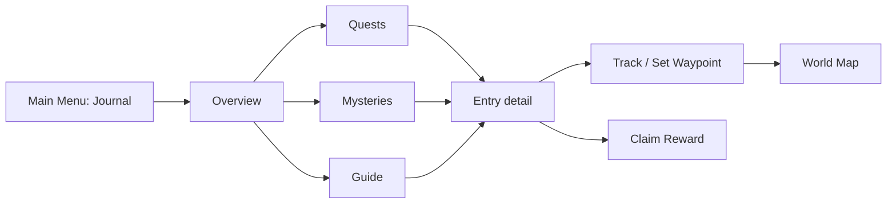

# Torch Journal Menu — Product, UX, and Implementation Plan

## Executive summary

The Journal should become a first-class destination from the Main Menu—not a
pre-battle setup screen. It should unify three related jobs:

1. Track active quests and multi-step objectives.
2. Preserve discovered mystery and lore information.
3. Guide new players through the game's mechanics with rewarding milestones.

The existing Journal tile in [`src/ui/menu-overlay.tsx`](src/ui/menu-overlay.tsx)
should become an available destination from the first world. It may initially
expose an empty/read-only shell while the save, profile, inventory, and reward
contracts are being established; the full Journal must not pretend to persist
progress or grant items before those authorities exist.

## 1. Research findings

| Game | Useful pattern | Torch takeaway |
| --- | --- | --- |
| Stardew Valley | Story quests can be added automatically as onboarding, remain available without a deadline, and expose requirements and rewards through the quest journal. [Source](https://wiki.stardewvalley.net/Special_Orders) | Use the Journal as a persistent tutorial and quest record; avoid unnecessary timers. |
| Hollow Knight | Entries unlock from actions such as defeating enemies; repeated progress reveals deeper notes, lore, and rewards. Completed entries receive a distinct visual treatment. [Source](https://hollowknight.wiki/w/Hunter%27s_Journal_%28Hollow_Knight%29) | Mysteries should reveal progressively rather than appearing as complete encyclopedia articles. |
| Subnautica | Its Databank combines discovered creatures, scans, logs, survival tips, clues, and story information. [Source](https://subnautica.fandom.com/wiki/Databank_%28Subnautica%29) | Separate what the player knows from hidden future information; use spoiler-safe partial entries. |
| The Elder Scrolls Online | The Journal lists active quests, lets players focus one quest, and exposes objectives through the quest tracker and compass. [Source](https://www.elderscrollsonline.com/en-us/newplayerguide/questing) | Support one focused entry and one active map waypoint. |
| World of Warcraft | The Map & Quest Log combines quest lists, progress, and cartography, with map zooming, panning, and objective visibility. [Source](https://worldofwarcraft.blizzard.com/en-gb/news/15707238/patch-602-preview-user-interface) | “Show on Map” should be a first-class Journal action, not a separate manual workflow. |
| Xbox accessibility guidance | Recommends separate categories, concise objectives, deeper descriptions, progress counts, and optional waypoint/path assistance. [Source](https://learn.microsoft.com/en-us/gaming/accessibility/xbox-accessibility-guidelines/109) | Keep the scanning layer concise, with detail available on selection. |

### Research synthesis

The strongest shared pattern is a concise list that supports deeper inspection.
The Journal should not be a single undifferentiated transcript. It needs clear
categories, stable progress, one focused objective, and an explicit distinction
between discovered information and undiscovered information.

### Roadmap and scope guard

The current [ROADMAP.md](ROADMAP.md) makes deterministic save/reload/death/
respawn and replay the next Phase 1 milestone. World-local quests and
discovery are Phase 2, authored quests and mysteries are Phase 3, and profile
meta-progression is Phase 4. The Journal plan therefore has two valid entry
points:

1. **Read-only shell prototype:** enable the menu tile, render empty states and
   fixture content, and validate layout/accessibility without persistent
   progress or reward mutations.
2. **Functional Journal:** begin only after the save/profile/world contracts,
   authoritative inventory/reward transaction, and deterministic replay inputs
   are available. The implementation should update ROADMAP.md when this scope
   is approved.

This avoids putting profile-scoped Guide progress into a world-only
`GameState`, or presenting rewards that cannot yet be saved safely.

## 2. Information architecture



### Top-level sections

#### Overview

- “Continue your trail” card for the highest-priority incomplete entry.
- Claimable reward count.
- Active quest count.
- Mystery discovery count.
- Guide progress, such as `3/12 milestones`.
- Recently discovered entry.

#### Quests

- Active
- Reward Ready
- Completed
- Optional filters: Main, Side, Local, Repeatable

#### Mysteries

- Unsolved
- Resolved
- Recently Discovered

#### Guide

- Current Trail
- Gathering
- Combat
- Exploration
- Crafting/Homestead
- Progression

Completed entries should be filters or sections rather than separate primary
tabs. This keeps navigation compact and prevents the player from treating
archived content as current work.

Every list needs deterministic ordering: `priority`, then content category,
then stable content ID. “Highest priority,” “Next Up,” and “Recently
Discovered” must use explicit tie-breakers rather than array order. Entry rows
are keyed by stable IDs and must not reorder the focused/selected item when a
progress event arrives. Persist or derive `seen`/`unread` state so “new clue”
and reward badges do not repeat indefinitely; announce those changes through
text as well as color or icons.

## 3. Visual layout

### Desktop

Use the existing wide opaque menu shell:

- Header: `Journal`, close button, and optional `3 rewards ready` indicator.
- Tab bar: Overview, Quests, Mysteries, Guide.
- Two-column body:
  - Left: entry list, approximately 280–320px.
  - Right: selected entry detail.
- Detail footer remains visible with:
  - `Track`
  - `Show on Map`
  - `Claim Reward`
  - `Back` or `Close`

The Journal should be implemented as an extracted feature surface such as
`src/ui/journal-screen.tsx`, with typed selectors and small list/detail
components. Keep `menu-overlay.tsx` responsible for routing, dialog ownership,
input mode, and focus restoration rather than growing another monolithic
screen. Use the existing Base UI-backed primitives through
`src/ui/primitives.tsx` and consume the canonical token chain rather than
adding Journal-local colors, radii, or typography.

### Narrow screens

Use a master/detail flow:

1. Journal list fills the panel.
2. Selecting an entry pushes a detail view.
3. Detail view has a clear `Back to Journal` control.
4. Only the active scroll region scrolls.
5. The claim/action footer remains reachable on short viewports.

On mobile, selecting an entry must move focus to the detail heading; returning
must restore focus to the originating list row. Accordion controls must be
semantic buttons with `aria-expanded` and `aria-controls`, and must not contain
nested interactive controls.

The surface should be reviewed at `1280×720`, `1170×624`, `390×844`, and
`320×568`.

## 4. Quest design

### Collapsed quest row

Each quest row should include:

- Expand/collapse chevron.
- Quest type icon.
- Title.
- Current objective summary.
- Progress text, such as `2/5`.
- Status label:
  - Active
  - Reward Ready
  - Completed
  - Failed
  - Locked
- Small reward preview.
- Focus/waypoint indicator.

Rows should preserve stable ordering so progress updates do not cause the
selected quest to jump.

### Expanded quest row

The expanded row should reveal a compact step timeline:

```text
✓ Find the old trail
✓ Speak with the homestead keeper
● Chop a tree                     0/1
○ Return to the homestead
```

For longer quests:

- Show the first incomplete step by default.
- Allow 5–10+ steps without making the entire Journal unreadable.
- Use a vertical timeline rather than nested cards.
- Keep future steps visible only when the quest intends to reveal them.
- Completed steps remain readable but visually quiet.
- The current step uses the gold accent and an explicit `Current` label.

Selecting the row opens the full detail pane with:

- Narrative description.
- Step list.
- Current objective.
- Location information.
- Reward details.
- `Track` and `Show on Map`.
- Abandon only for explicitly abandonable repeatable quests.

Main quests and tutorial milestones should not be abandon-able.

## 5. Mystery design

Mysteries should behave like a discovery notebook rather than a conventional
quest list.

### Mystery list row

Show:

- Discovery icon or silhouette.
- Only entries whose discovery rule has fired. Do not enumerate every hidden
  mystery by default; if product design later wants a placeholder, it must use
  a generic count such as `Unidentified leads` without revealing the entry's
  identity, location, or clue count.
- Name after discovery; otherwise use a generic discovery notification rather
  than a named `Unknown Mystery` row.
- State: `Unsolved`, `New Clue`, or `Resolved`.
- Clue count, such as `3/7 clues`.
- Last known location.
- New-entry indicator.

### Mystery detail

Sections:

- **Known** — facts the player has actually discovered.
- **Clues** — chronological or spatial clue cards.
- **Leads** — optional next actions derived from discovered information.
- **Location** — known location or approximate region.
- **Reward** — shown when the mystery is resolved.
- **Reveal policy** — do not expose undiscovered answers, future locations, or
  hidden solution text.

Mystery entries should support incremental updates. A new scan, interaction,
enemy encounter, map discovery, or special-object inspection can unlock another
clue.

## 6. Guide and onboarding milestones

The Guide should be a structured mechanic trail, not a wall of unrelated
chores.

Example milestones:

- Move one tile.
- Reveal new terrain.
- Open the Inventory.
- Equip an ability.
- Chop a Tree `0/1`.
- Mine Ore `0/1`.
- Defeat an Enemy `0/1`.
- Use a Skill ability `0/1`.
- Return to the Homestead.
- Craft an item.
- Build a homestead structure.
- Interact with a Pet.

### Guide behavior

- Unlock milestones progressively through prerequisites.
- Keep only one or two milestones visibly emphasized as `Next Up`.
- Allow players to browse all unlocked milestones.
- Keep locked future systems visible but muted, with a short explanation.
- Do not route players through a pre-battle configuration screen.
- Let the Guide remain useful after onboarding by becoming a mechanic mastery
  log.

Each milestone has:

- Title.
- One-sentence explanation.
- Numeric or boolean progress.
- Reward preview.
- `Claim Reward` when complete.
- Optional `Show on Map` when location-specific.

Guide milestones should generally be profile-level and complete once across
worlds. World-specific objectives should remain world-local. Gameplay-derived
milestones such as chopping, mining, combat, and map reveal must advance from
accepted deterministic simulation events. Presentation-only milestones such as
opening Inventory or opening the Journal should be recorded by the application
profile adapter (or by an explicitly documented replay input), not smuggled
into low-level gameplay rules.

## 7. Rewards

Completion and reward claiming should be separate states:

```text
Incomplete → Complete / Reward Ready → Claimed
```

Recommended behavior:

- Completion is automatic when the objective condition is met.
- Reward claiming is explicit.
- The Journal tile receives a badge for claimable rewards.
- Claiming emits a short confirmation, such as `Reward claimed: Iron Axe`.
- Claim buttons are disabled until completion.
- Claiming is idempotent; a reward cannot be claimed twice.
- If inventory capacity is full, do not silently discard the reward. Use either:
  - a pending-reward mailbox, or
  - a blocking message explaining what must be freed.

The functional reward system depends on the authoritative inventory/equipment
and save work already planned for Phase 2. The read-only Journal shell may show
fixture reward previews, but it must not mutate the current sparse inventory
map as if it were the final economy.

Rewards need an explicit discriminated union rather than an untyped list:

```ts
type JournalReward =
  | { kind: 'item'; itemId: string; quantity: number }
  | { kind: 'currency'; currencyId: string; amount: number }
  | { kind: 'ability-unlock'; abilityId: string }
  | { kind: 'recipe-unlock'; recipeId: string }
  | { kind: 'profile-unlock'; unlockId: string };
```

Claiming must be one atomic, idempotent transaction. A failed claim must leave
the Journal in `Reward Ready`, not mark it claimed. Repeatable quests require a
stable instance/claim key rather than a single entry ID. The reward owner must
be explicit: item/currency inventory is world-local, while profile unlocks are
profile-owned. Mailbox ownership and capacity behavior must be decided before
reward-bearing content is approved.

Reward definitions should support:

- Items and quantities.
- Currency.
- Ability unlocks.
- Recipe unlocks.
- Profile-level unlocks.
- Future reward types without changing the Journal UI contract.

## 8. Map and waypoint integration

Use one active focused Journal entry and one active waypoint.

`Track` and `Show on Map` should be coupled in the first implementation:
tracking an entry sets focus and its current objective waypoint; `Show on Map`
then opens the Map without changing the selected Journal entry. This avoids a
focused quest and unrelated waypoint drifting apart. A future manual map pin
can be added as a separate feature.

### Journal actions

- **Track**
  - Sets the entry as the focused objective.
  - Updates the compact HUD objective tracker.
- **Show on Map**
  - Sets the waypoint and opens the Map screen.
- **Clear Waypoint**
  - Removes the active marker.

### Waypoint behavior

Waypoint targets should support:

- Fixed coordinate.
- Stable location ID.
- Stable entity ID when appropriate.
- Derived location rule for procedural content.

Represent this as a serialized discriminated union, not a UI object:

```ts
type WaypointTarget =
  | { kind: 'coordinate'; position: Position }
  | { kind: 'location'; locationId: string }
  | { kind: 'entity'; entityId: string }
  | { kind: 'derived'; resolverId: string; parameters: Record<string, string> };
```

The resolved waypoint needs an explicit status: `active`, `unresolved`, or
`removed`. Resolution must use the world seed, generation version, and stable
IDs. A coordinate outside the current revealed bounds should either center the
Map on the target while leaving terrain unexplored, or show a clear edge/off-map
indicator; it must never reveal fog. A removed entity should produce the stale
message rather than silently moving the pin.

Do not store a transient Phaser entity reference. Generated entities may be
pruned or regenerated, so targets must resolve through stable IDs or
deterministic coordinates.

The Map should show:

- Gold waypoint marker.
- Entry title or abbreviated label.
- Hero marker.
- Unexplored destination indicator when the location is outside revealed
  terrain.
- No automatic fog reveal.
- No required pathfinding in the first implementation.

If the target is unavailable or destroyed, the Journal should say:

> This objective no longer has a valid location.

Setting or clearing a waypoint should not consume a turn.

Journal → Map → Journal navigation must preserve the selected entry and return
focus to the invoking control when the Map or Journal closes. Replace the
current no-payload map-open event with a typed transition payload when Journal
needs to open the Map with a target.

## 9. Simulation and data model

Keep Journal content data-driven and separate from React.

### Content definitions

Likely new module:

- `src/content/journal.ts`

Conceptual definitions (the exact names can change during implementation, but
the unions and ownership boundaries should remain explicit):

```ts
JournalEntryDefinition {
  contentVersion: number
  id
  kind: 'quest' | 'mystery' | 'milestone'
  scope: 'profile' | 'world'
  title
  summary
  description
  category
  priority: number
  prerequisites: PrerequisiteDefinition[]
  objectives[]
  rewards: JournalReward[]
  location?: JournalLocation
  discoveryRule?: DiscoveryRule
  repeatable?: { instanceKey: string; maxClaims?: number }
  expiration?: ExpirationRule
}
```

```ts
type ObjectiveDefinition =
  | {
      id: string;
      kind: 'counter';
      label: string;
      target: number;
      trigger: AcceptedEventTrigger;
      hiddenUntil?: string;
    }
  | {
      id: string;
      kind: 'boolean';
      label: string;
      trigger: AcceptedEventTrigger;
      hiddenUntil?: string;
    }
  | {
      id: string;
      kind: 'discovery';
      label: string;
      discoveryId: string;
      hiddenUntil?: string;
    };
```

```ts
ProfileJournalState {
  schemaVersion: number;
  guideProgress: Record<string, ObjectiveProgress>;
  profileRewardClaims: Record<string, true>;
  seenEntryIds: Record<string, true>;
}

WorldJournalState {
  schemaVersion: number;
  questProgress: Record<string, QuestRuntimeState>;
  mysteryProgress: Record<string, MysteryRuntimeState>;
  worldRewardClaims: Record<string, true>;
  focusedEntryId?: string;
  waypoint?: { target: WaypointTarget; status: 'active' | 'unresolved' | 'removed' };
}
```

`ObjectiveProgress`, `QuestRuntimeState`, and `MysteryRuntimeState` must carry
explicit status transitions (`locked`, `active`, `complete`, `reward-ready`,
`claimed`, `failed`, `expired`, `abandoned`) and stable IDs. Repeatable quest
claims must use an instance key. Clue IDs, ordering, last-seen/read state, and
hidden-step reveal rules must be represented rather than inferred in React.

`ProfileJournalState` belongs in `ProfileSave`; `WorldJournalState` belongs in
`WorldSave`. Focus and waypoint are presentation-adjacent: keep them in the
world save only if the HUD should restore them after reload, otherwise keep them
in the session/UI adapter. That choice must be explicit. If profile progress
can affect gameplay outcomes, include the profile state in the deterministic
replay input contract; otherwise keep it informational.

### Simulation integration

Add Journal-specific pure logic in something like:

- `src/sim/journal.ts`

The resolver should:

1. Apply the gameplay command.
2. Produce deterministic simulation events.
3. Advance Journal progress from accepted events at the top-level command
   boundary in `src/sim/simulation.ts`.
4. Emit Journal update and reward-ready events.
5. Return the new state to React.

Journal progression must consume only accepted, deterministic events. Add
explicit events or before/after selectors for behaviors not currently covered,
such as tile reveal counts and ability-category usage. Do not update progress
from rejected commands or low-level helper calls.

Potential commands:

- `set-journal-focus`
- `set-waypoint`
- `clear-waypoint`
- `claim-journal-reward`

These are non-turn-consuming state commands and must not trigger enemy
responses. Presentation-only observations such as opening Inventory belong in
the application/profile adapter unless the determinism contract is explicitly
extended to include them.

Potential events:

- `journal-progressed`
- `journal-entry-discovered`
- `journal-entry-completed`
- `journal-reward-ready`
- `journal-reward-claimed`
- `waypoint-set`
- `waypoint-cleared`

The UI should consume selectors rather than implement progress rules.

## 10. Repository integration points

- [`src/ui/menu-overlay.tsx`](src/ui/menu-overlay.tsx)
  - Enable Journal.
  - Add the `journal` screen.
  - Route dialog/input-mode/focus behavior to the extracted Journal feature.

- New [`src/ui/journal-screen.tsx`](src/ui/journal-screen.tsx)
  - Own typed selectors, tabs, list/detail layout, accordions, rewards, and
    map actions without making React the simulation authority.

- [`src/sim/types.ts`](src/sim/types.ts)
  - Add Journal state, commands, events, objectives, rewards, and waypoint
    types.

- [`src/sim/simulation.ts`](src/sim/simulation.ts)
  - Advance Journal progress at the top-level command boundary after action
    resolution and before returning the command result.

- [`src/sim/world.ts`](src/sim/world.ts)
  - Seed initial world state and world-local Journal state. `src/sim/state.ts`
    currently only owns cloning and should not become the initial-state owner.

- New save/profile modules (the repository does not yet have these):
  - Define versioned `ProfileSave` and `WorldSave` envelopes.
  - Add migrations and atomic reward persistence before functional claims.
  - Keep profile Guide state separate from world quest/mystery state.

- [`src/game/session.ts`](src/game/session.ts)
  - Add typed helpers for focus, waypoint, and reward claims.

- [`src/game/input-bindings.ts`](src/game/input-bindings.ts)
  - Add an optional `Open Journal` binding, likely `J`.

- Map rendering in [`src/ui/menu-overlay.tsx`](src/ui/menu-overlay.tsx)
  - Render waypoint markers and support a typed Journal → Map transition.

- [`src/styles.css`](src/styles.css)
  - Add Journal layout styles using existing Torch tokens only.

## 11. Implementation phases

### Phase 0 — Product and data contract

Finalize:

- Entry types.
- Profile/world scope.
- Reward behavior.
- Mystery reveal rules.
- Waypoint semantics.
- Abandon/expiry rules.
- Inventory-full behavior.

### Phase 1 — Save, replay, and state foundations

This aligns with the current ROADMAP next milestone and must precede
reward-bearing functional Journal content.

- Implement versioned `ProfileSave` and `WorldSave` envelopes.
- Add deterministic round-trip serialization and migrations.
- Complete save/reload/death/respawn behavior.
- Define how profile state participates in replay inputs.
- Establish authoritative inventory/equipment ownership and atomic mutation
  boundaries.

### Phase 2 — Read-only Journal shell and Guide prototype

This phase may run as a UI prototype while Phase 1 is being completed.

- Enable Journal from Main Menu.
- Extract the Journal feature surface from `menu-overlay.tsx`.
- Implement Overview, Guide layout, empty states, badges, accordions, and
  responsive/focus behavior.
- Use fixture or read-only progress only until ProfileSave is available.
- Seed only milestones backed by existing actions: movement, reveal, chop,
  mine, combat, and ability use. Mark crafting, buildings, and pets as
  content-gated future milestones until their systems exist.

### Phase 3 — Functional Guide and quests

- Add profile-scoped Guide progress and world-scoped quest progress.
- Add typed objective triggers and deterministic event reducers.
- Implement data-driven quests and collapsible multi-step entries.
- Add explicit reward transactions after inventory/save foundations are ready.
- Add completed quest history and repeatable quest instance keys.
- Add browser smoke coverage for a 5–10 step quest.

### Phase 4 — Waypoints and focused objective presentation

- Add typed waypoint commands and serialized target resolution.
- Connect `Track` and `Show on Map`.
- Render active, unresolved, removed, and off-screen waypoint states.
- Add focused objective HUD treatment that respects the Action Hand, HP rail,
  safe areas, and 320px-wide layouts.
- Add typed Journal → Map transitions and focus restoration.

### Phase 5 — Mysteries

- Add clue discovery and partial-entry rendering once the owning discovery
  actions/events exist.
- Add read/unread and last-seen state.
- Add spoiler-safe locked text and discovered-entry privacy rules.
- Add mystery completion rewards only after the reward transaction is stable.
- Add discovered-location linking.

### Phase 6 — Polish and complete verification

- Add notification/toast treatment and `aria-live` announcements.
- Add reduced-motion behavior.
- Test keyboard, controller, touch, focus restoration, long content, stale
  waypoints, and short viewports.
- Update ROADMAP.md and the relevant architecture/save documentation to record
  the approved Journal scope and ownership decisions.

## 12. Verification plan

### Simulation tests

Cover:

- `Chop Tree 0/1 → 1/1`.
- `Mine Ore 0/1 → 1/1`.
- Multi-step quest progression.
- Prerequisite unlocking.
- Mystery clue discovery.
- Fixed-seed replay with Journal events and state included in the transcript.
- Rejected commands not advancing turns or Journal progress.
- Duplicate event delivery and repeated reward claims remaining idempotent.
- Reward claim idempotency.
- Inventory-full behavior.
- Waypoint commands not advancing turns.
- Active, unresolved, removed, and off-screen waypoint handling.
- Profile/world Journal save round trips and migrations.

### Browser tests

Add coverage for:

- Journal tile enabled and badge state.
- Overview, Quests, Mysteries, and Guide tabs.
- Expand/collapse behavior.
- Long quest step lists and internal scrolling.
- Reward claim feedback.
- `Track` and `Show on Map`.
- Map waypoint rendering.
- Off-screen and stale waypoint messaging.
- Escape/backdrop dismissal and focus restoration.
- Keyboard navigation and accessible progress labels.
- `aria-expanded`/`aria-controls` accordion semantics, `aria-live` reward
  announcements, read/unread badges, and no nested controls.
- Stable ordering and focus retention when progress updates.
- Long labels, internal scroll ownership, 42px hit targets, and reduced motion.
- All four required viewport sizes.

Final gate:

```bash
npm run verify
```

## 13. Recommended decisions for approval

### Scope to approve first

- Approve a read-only Journal shell immediately if the goal is visual/UI
  validation while save work is incomplete.
- Approve functional progress only after the save/profile/world and replay
  contracts in Phase 1 are complete.
- Approve reward claims only after authoritative inventory ownership,
  capacity/mailbox behavior, and atomic persistence are implemented.

### Product defaults

- Journal is available from the first world.
- Guide milestones are profile-level; quests and mysteries are world-local.
- Only one Journal entry is focused at a time.
- Only one waypoint is active at a time.
- `Track` sets both focus and the current objective waypoint; `Show on Map`
  opens the Map without changing the selected entry.
- Rewards require an explicit claim.
- Main and tutorial quests never expire, fail, or disappear by abandonment.
- Mysteries reveal only discovered information and only appear after discovery.
- Automatic routing/pathfinding is out of scope for the first version.
- Inventory-full rewards must be preserved, never discarded.

### Phase 0 acceptance criteria

Before functional implementation begins, the product and engineering owners
must explicitly decide:

- Whether focus and waypoint restore after reload, death, and world switching.
- Whether Guide progress is shared across all worlds or resettable per profile.
- Which quest types may expire, fail, repeat, or be abandoned.
- Whether reward overflow uses a mailbox or blocks claiming.
- Which currency, unlock, and recipe reward types are in the first release.
- Whether UI-only observations such as opening Inventory are included in replay
  or stored only as profile presentation state.
- What mystery placeholder behavior is allowed without leaking discovery data.
